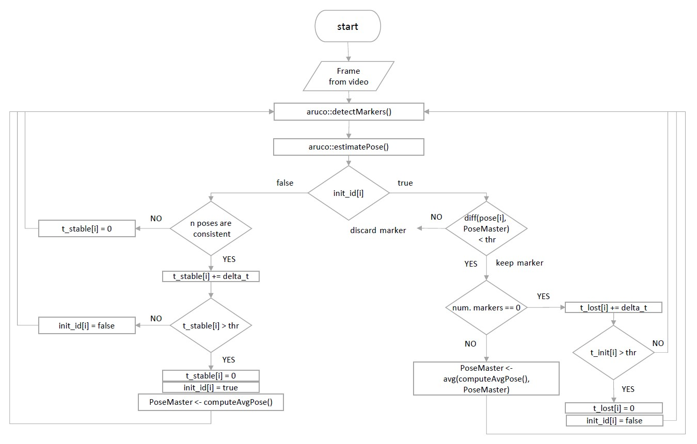

# Augmented reality module with ArUco markers

This repository contains the code of a C++ module for augmented reality with ArUco markers. 

The aim of the module is to develop a method that estimates the camera's pose as accurately as possible and that is able to deal with different issues that can arise in the real world. The method is based on the combination of different markers and their tracking in time to stabilize the estimated pose. 

## Structure of the repo
+ **src/**          main and header files
+ **utils/**        contains scripts for calibration, markers' generation and plotting
+ **old_versions/** old versions of the main script
+ **graphs/**       schemes of the control logic

## Graph of the control logic

